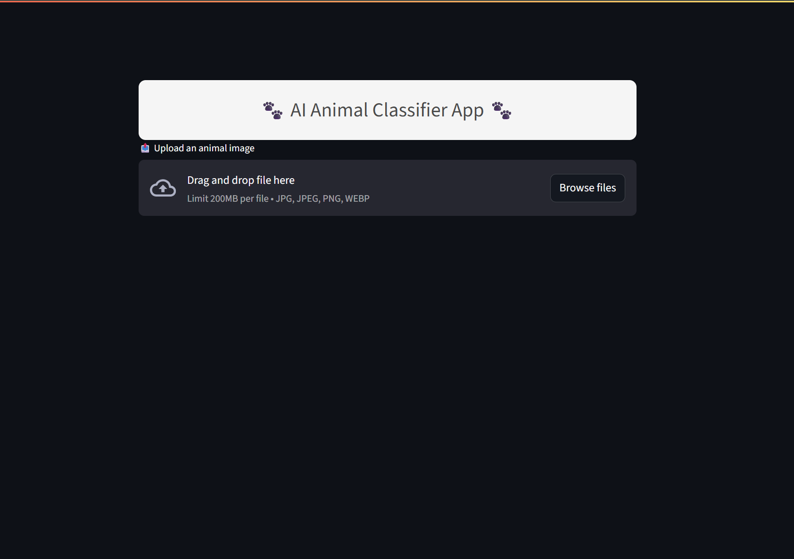
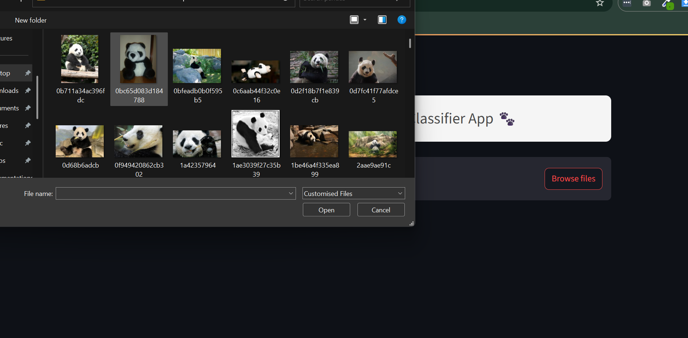
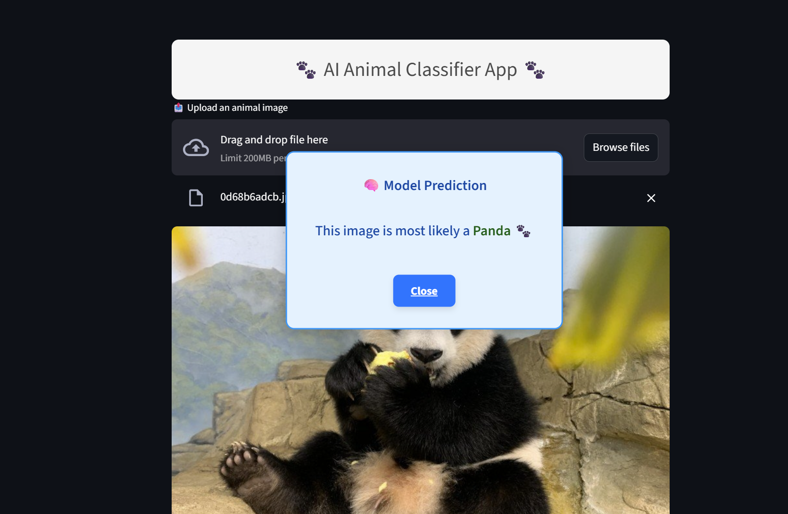

# 🐾 AI Animal Classifier

[](LICENSE)


A deep learning-based web app that predicts the animal species from an uploaded image using a fine-tuned MobileNetV2 model. The app is built with **Streamlit** and supports predictions across **19+ animal classes**.

---

## 🚀 Features

- 🐕 Upload animal image (JPG, PNG, JPEG, WEBP)
- 🔍 Predicts among 19+ animal species
- 💬 Popup result with prediction label
- 🔁 Refresh button for quick retry
- 📱 Responsive and user-friendly interface
- ⚙️ Powered by MobileNetV2 + Streamlit

---

## 📸 App Preview

| Upload Interface | Prediction Popup |
|------------------|------------------|
|  |  |
|  |  |

---

## 🛠️ Tech Stack

- 🐍 Python
- 🤖 TensorFlow / Keras
- 🧠 MobileNetV2
- 🌐 Streamlit
- 📦 NumPy & Pillow

---

## ⚙️ Installation

Clone the repository:

```bash
git clone https://github.com/DevWaqarAhmad/AI-Powered-Animal-Classifier.git
cd AI-Powered-Animal-Classifier
